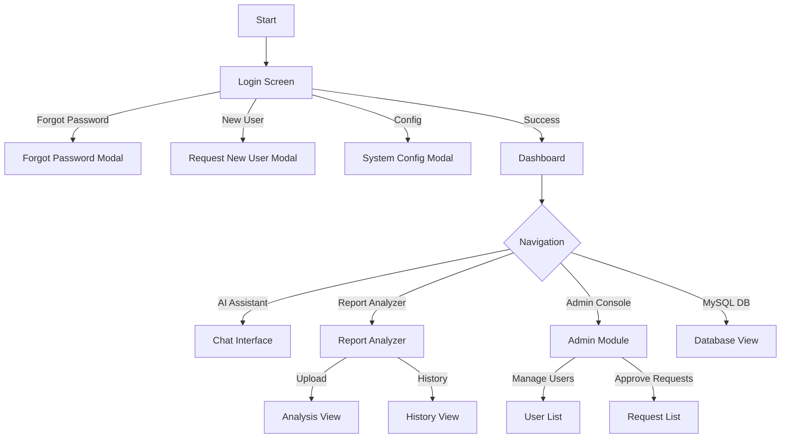

# Front End UI Specifications
## Project: Medostel AI

This document details the User Interface (UI) specifications, validation rules, and flow diagrams for the Medostel AI application.

### 1. UI Flow Diagram

---

### 2. UI Specifications & Validations

#### 2.1 Screen: Login Module
**Purpose:** Authenticate users and provide access to the system.

**UI Elements:**
*   **User ID Input:** Text field for Email/User ID.
*   **Password Input:** Password field with visibility toggle.
*   **Login Button:** Triggers authentication.
*   **Forgot Password Link:** Opens modal.
*   **Request New User Button:** Opens registration modal.
*   **System Config Icon:** Top-right gear icon for DB connection settings.

**Validations:**
1.  **User ID Existence:**
    *   *Rule:* On blur, check if User ID exists in the database.
    *   *Feedback:*
        *   Exists & Active: Green Check icon.
        *   Exists & Inactive: Yellow Alert icon + "User ID exists but inactive".
        *   Does Not Exist: Red Alert icon + "User ID not found".
2.  **Password:**
    *   *Rule:* Required field.
    *   *Feedback:* Login button disabled if empty.
3.  **Login Submission:**
    *   *Rule:* Verify credentials against `User_Login` table.
    *   *Feedback:* Show error message "Incorrect password" on failure.

#### 2.2 Screen: Request New User Modal
**Purpose:** Allow new users to request access.

**UI Elements:**
*   **Personal Info:** User Name (Email), First Name, Last Name, Role (Dropdown), Organisation.
*   **Contact Info:** Address 1, Address 2, State (Dropdown), City (Dropdown), Pin Code (Auto-filled), Mobile Number.

**Validations:**
1.  **User Name (Email):**
    *   *Rule:* Must be a valid email format. Must be unique.
    *   *Feedback:* Async check on blur. Show "Email ID exists" if duplicate.
2.  **Mobile Number:**
    *   *Rule:* Must be unique.
    *   *Feedback:* Async check on blur. Show "Mobile Number exists" if duplicate.
3.  **State/City:**
    *   *Rule:* City dropdown populates based on selected State. Pin Code auto-populates based on City.
4.  **Mandatory Fields:** All fields except Address 2 are mandatory.

#### 2.3 Screen: Report Analyzer
**Purpose:** Upload and analyze medical reports.

**UI Elements:**
*   **Tabs:** "Patient Report Analysis" (Active), "Historical Analysis".
*   **Upload Zone:** Drag & drop area or click to select file.
*   **Analyze Button:** Triggers AI processing.
*   **Analysis Result View:**
    *   **Toggle:** Physician View vs. Patient View.
    *   **Sections:** Demographics, Summary, Deep Dive, Pathological Markers, Clinical Parameters Table, Diagnosis, Next Actions.
*   **History Table:** List of past reports with "View" and "Download PDF" buttons.

**Validations:**
1.  **File Upload:**
    *   *Rule:* Max size 10MB. Allowed types: PDF, JPEG, PNG.
    *   *Feedback:* Alert "File too large" if > 10MB.
2.  **Analysis:**
    *   *Rule:* File must be selected before clicking Analyze.
    *   *Feedback:* Open file selector if no file selected.

#### 2.4 Screen: Dashboard
**Purpose:** Central hub for user activity.

**UI Elements:**
*   **Sidebar:** Navigation links (Dashboard, AI Assistant, Report Analyzer, Admin Tools).
*   **Welcome Header:** Greeting with User Name.
*   **Health Metrics:** Visual charts (e.g., Heart Rate, BP trends) using Recharts.
*   **Quick Actions:** Shortcuts to common tasks.

#### 2.5 Screen: Admin Console
**Purpose:** Manage users and system requests.

**UI Elements:**
*   **User Management Tab:** List of all users with status (Active/Inactive). Edit/Delete actions.
*   **Requests Tab:** List of pending `New_User_Request` items. Approve/Reject actions.

**Validations:**
1.  **Access Control:**
    *   *Rule:* Only users with `currentRole = 'Administrator'` can access this view.
    *   *Feedback:* Redirect or hide link for non-admins.

---

### 3. User Journeys

#### Journey 1: New User Registration
1.  User opens app and clicks "Request New User ID".
2.  User fills in the form (Personal & Contact details).
3.  System validates Email and Mobile uniqueness.
4.  User submits form.
5.  System shows "Request Submitted" success modal.
6.  Admin logs in, navigates to Admin Console -> Requests.
7.  Admin approves the request.
8.  User can now log in.

#### Journey 2: Medical Report Analysis
1.  User logs in and navigates to "Report Analyzer".
2.  User uploads a Blood Test PDF.
3.  User clicks "Analyze Report".
4.  System shows loading steps ("Extracting...", "Analyzing...").
5.  System displays the Analysis Result.
6.  User toggles to "Patient View" for a simplified summary.
7.  System automatically generates a PDF of the analysis.
8.  User clicks "Download PDF" to save the report.
